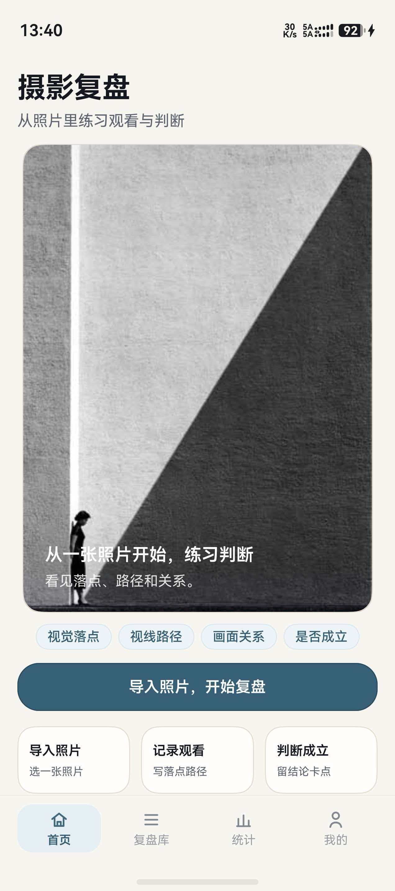
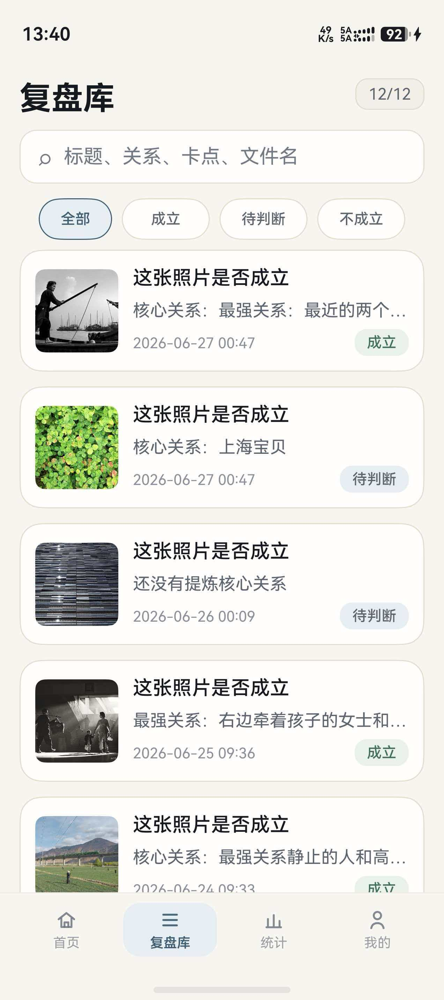
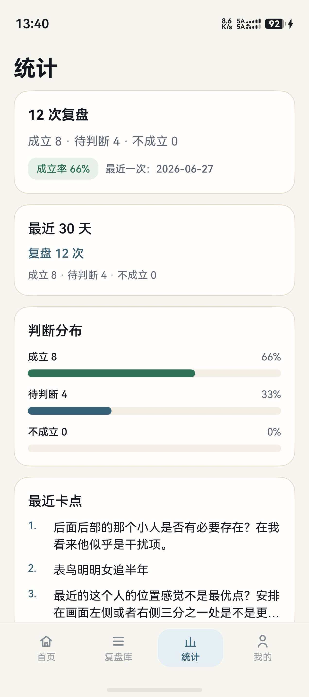
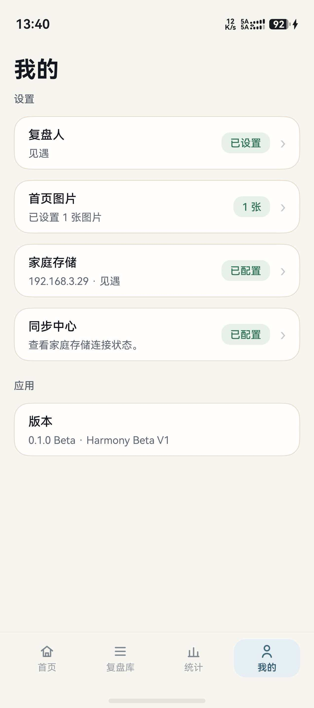

# HarmonyOS 四个主 Tab UI 基线（2026-06-28）

本文件固化 2026-06-28 真机验收截图，作为 HarmonyOS 首页 / 复盘库 / 统计 / 我的四个主 Tab 的 UI baseline。

文档角色：这是带日期的验收快照，不是产品需求文档，也不是最新代码的逐像素截图。它只约束下述四个主 Tab；编辑页、预览页和设置子页不在本快照范围内。

结论：这版四 Tab 已进入 UI 收口基线。除非出现功能阻断、可访问性问题、底部遮挡、明显文字溢出或回归，不建议继续开启 HarmonyOS UI 小修。

权威边界：这些截图用于约束四个主 Tab 的结构、密度和视觉方向，不作为后续提交的逐像素发布证明。当前生产基线以华为审核通过的安装包、Git 标签 `v0.1.0` 和提交 `bd4fcda` 为准；所有后续 UI 变更按 [UI 收口规则](./UI_CLOSURE_RULES.md) 执行。

替换规则：四个主 Tab 发生通过准入的结构变更后，必须完成真机验收，新增带日期的截图目录和基线文档，并在同一提交中更新引用；旧快照随 Git 历史保留，不继续充当当前入口。

## 基线截图

| Tab | 截图 | 文件 |
| --- | --- | --- |
| 首页 |  | `docs/assets/main-tabs-ui-baseline-20260628/home.jpg` |
| 复盘库 |  | `docs/assets/main-tabs-ui-baseline-20260628/library.jpg` |
| 统计 |  | `docs/assets/main-tabs-ui-baseline-20260628/stats.jpg` |
| 我的 |  | `docs/assets/main-tabs-ui-baseline-20260628/my.jpg` |

## 人工验收清单

### 首页

- 首屏保持固定，不恢复纵向滚动。
- 顶部标题、首页图、标签、主按钮、三步卡片在首屏内完整呈现。
- 用户配置首页图后仍按固定 Hero 区展示，多图轮播不引发布局跳动。
- 底部 Tab 不遮挡“导入照片，开始复盘”和三步卡片。
- 不新增解释型大段文案。

### 复盘库

- 标题下方不保留长说明文案。
- 搜索框和筛选胶囊紧跟标题区，首条复盘记录尽早露出。
- 列表卡片保留缩略图、标题、摘要、时间、判断状态。
- 底部 Tab 不遮挡列表末尾内容。
- 不出现大面积空白或空占位容器。

### 统计

- 标题下方不保留长说明文案。
- 第一张统计卡片紧跟标题区露出。
- 统计概览、最近 30 天、判断分布、最近卡点保持统一卡片节奏。
- 最近卡点列表滚动到底部时不被底部 Tab 遮挡。
- 仅在空状态显示解释文案。

### 我的

- 不恢复“当前复盘人”顶部大卡片。
- 标题下方无副文案大空白，设置分组直接露出。
- 设置分组不显示说明文案。
- 复盘人、首页图片、家庭存储、同步中心入口正常保留。
- 应用版本卡片保留。
- 页面可滚动，但不出现无意义顶部空白。

### 底部 Tab

- 保持四项：首页、复盘库、统计、我的。
- 选中态、背景和安全区颜色与截图一致。
- 图标和文字不被系统手势区遮挡。

## 自动回归锚点

后续改动如果触达四个主 Tab、`AppShellPage`、`AppDesign` 或 `DesignTokens`，至少运行：

```bash
node scripts/verify_ui_closure.mjs
```

如果统一门禁失败，可先单独定位主 Tab 和“我的”页约束：

```bash
node scripts/verify_main_tabs_ui_baseline.mjs
node scripts/verify_my_page_information_architecture.mjs
```

如触达构建相关代码，继续运行：

```bash
JAVA_HOME=/Library/Java/JavaVirtualMachines/zulu-11.jdk/Contents/Home bash scripts/build_hap.sh
```

## 不建议继续 UI 小修

后续 HarmonyOS 迭代优先级：

1. 功能正确性、导出/同步可靠性、真机流程闭环。
2. 明确回归修复，例如底部遮挡、文字溢出、页面无法滚动。
3. 用户真实验收反馈中反复出现的可用性问题。

不建议继续处理：

- 只为了“更顺眼”的单点间距微调。
- 未影响首屏效率的卡片高度微调。
- 无新用户证据支撑的字号、圆角、颜色反复调整。
- 为填补空白而新增说明文案或大卡片。
