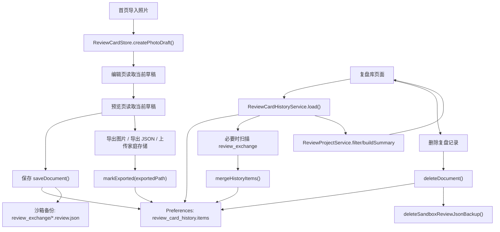

# 复盘库存储架构审计

更新时间：2026-06-23

本文基于当前 HarmonyOS 端代码实现整理，目标是准确描述复盘库当前的主存储、备份、恢复、删除和风险边界。本文不代表未来目标架构，只描述现在已经落地的行为。

相关文档：

- 产品字段模型见 [`DATA_MODEL.md`](./DATA_MODEL.md)
- `review.json` 交换字段语义见 [`REVIEW_JSON_SEMANTICS.md`](./REVIEW_JSON_SEMANTICS.md)

## 一、当前存储架构

### 1. `ReviewCardStore` 的职责

- `ReviewCardStore` 是编辑态的内存单例。
- 它负责在首页、编辑页、预览页之间暂存“当前这张正在复盘的文档”。
- 它不负责复盘库列表的长期持久化。
- 它的典型能力包括：
  - 创建一条新的照片草稿
  - 读取当前草稿
  - 覆盖当前草稿
  - 在保存前刷新 `updatedAt`

参考代码：
- [entry/src/main/ets/services/ReviewCardStore.ets](/Users/wangbo/Documents/Codex/codexPro/skymap-HarmonyOS/entry/src/main/ets/services/ReviewCardStore.ets:8)

### 2. `ReviewCardHistoryService` 的职责

- `ReviewCardHistoryService` 是复盘库历史记录的主持久化服务。
- 它负责：
  - 从 `Preferences` 读取历史记录
  - 将 `ReviewCardHistoryItem[]` 序列化为 JSON 并写回 `Preferences`
  - 在保存/更新时写入一份 `review.json` 沙箱备份
  - 在加载时按条件扫描 `review_exchange` 目录并尝试恢复历史项
  - 删除历史项
  - 维护 `exportedPath`
  - 输出诊断信息

参考代码：
- [entry/src/main/ets/services/ReviewCardHistoryService.ets](/Users/wangbo/Documents/Codex/codexPro/skymap-HarmonyOS/entry/src/main/ets/services/ReviewCardHistoryService.ets:263)

### 3. `ReviewProjectService` 的职责

- `ReviewProjectService` 不负责存储。
- 它建立在 `ReviewCardHistoryService.load(...)` 返回的数据之上，负责：
  - 搜索
  - 判断状态筛选
  - 复盘库摘要构建
  - 首页/复盘库统计
  - 轻量摘要文案提炼

换句话说，它是“读模型加工层”，不是“写入层”。

参考代码：
- [entry/src/main/ets/services/ReviewProjectService.ets](/Users/wangbo/Documents/Codex/codexPro/skymap-HarmonyOS/entry/src/main/ets/services/ReviewProjectService.ets:88)

### 4. `Preferences(review_card_history.items)` 的职责

- 当前复盘库的主数据源是 HarmonyOS `@ohos.data.preferences`。
- `Preferences` 名称为：
  - `review_card_history`
- 主 key 为：
  - `items`
- 该 key 的值是一个 JSON 字符串，反序列化后为 `ReviewCardHistoryItem[]`。

当前每条历史项结构：

```ts
interface ReviewCardHistoryItem {
  document: ReviewCardDocument;
  exportedPath: string;
}
```

其中：
- `document` 保存复盘正文和图片引用
- `exportedPath` 保存导出结果引用

参考代码：
- [entry/src/main/ets/services/ReviewCardHistoryService.ets](/Users/wangbo/Documents/Codex/codexPro/skymap-HarmonyOS/entry/src/main/ets/services/ReviewCardHistoryService.ets:19)
- [entry/src/main/ets/services/ReviewCardHistoryService.ets](/Users/wangbo/Documents/Codex/codexPro/skymap-HarmonyOS/entry/src/main/ets/services/ReviewCardHistoryService.ets:467)
- [entry/src/main/ets/model/ReviewCardModel.ets](/Users/wangbo/Documents/Codex/codexPro/skymap-HarmonyOS/entry/src/main/ets/model/ReviewCardModel.ets:84)

### 5. `review_exchange/*.review.json` 的职责

- `review_exchange` 目录位于应用沙箱 `context.filesDir` 下。
- 每次 `saveDocument` / `updateDocument` 时，会额外写入一份 `review.json` 备份。
- 这份备份的职责有两个：
  - 作为可恢复副本
  - 作为跨端交换的兼容格式基础

注意：
- 它不是复盘库列表的主查询源。
- 但当前实现已经支持在部分条件下扫描该目录并重建历史项。

参考代码：
- [entry/src/main/ets/services/ReviewCardHistoryService.ets](/Users/wangbo/Documents/Codex/codexPro/skymap-HarmonyOS/entry/src/main/ets/services/ReviewCardHistoryService.ets:474)
- [entry/src/main/ets/services/ReviewJsonExportService.ets](/Users/wangbo/Documents/Codex/codexPro/skymap-HarmonyOS/entry/src/main/ets/services/ReviewJsonExportService.ets:31)

### 6. `exportedPath` 的职责

- `exportedPath` 记录的是“这条复盘记录最近一次导出结果的引用”。
- 这个导出结果可能是：
  - 导出的图片在图库中的 URI
  - 导出的 `review.json` 目标 URI
  - 上传到家庭存储后的远端路径
- 它用于表达“这条复盘是否已导出/同步过”，不是原图路径。

参考代码：
- [entry/src/main/ets/services/ReviewCardHistoryService.ets](/Users/wangbo/Documents/Codex/codexPro/skymap-HarmonyOS/entry/src/main/ets/services/ReviewCardHistoryService.ets:437)
- [entry/src/main/ets/pages/PreviewPage.ets](/Users/wangbo/Documents/Codex/codexPro/skymap-HarmonyOS/entry/src/main/ets/pages/PreviewPage.ets:170)

### 7. `imageUri` 的含义和风险

- `imageUri` 保存的是原始照片的 URI 或路径引用。
- 当前复盘库不会保存原图二进制。
- 因此复盘记录本身只是“引用原图”，不是“把原图归档进复盘库”。

这带来的风险包括：
- 原图被用户删除后，`imageUri` 可能失效
- 系统资源 URI 的权限或可访问性可能变化
- 跨设备同步时，另一个设备无法直接使用本地 URI
- 仅凭复盘库记录无法保证永远重新打开原图

参考代码：
- [entry/src/main/ets/services/ReviewCardStore.ets](/Users/wangbo/Documents/Codex/codexPro/skymap-HarmonyOS/entry/src/main/ets/services/ReviewCardStore.ets:16)
- [entry/src/main/ets/services/ReviewProjectService.ets](/Users/wangbo/Documents/Codex/codexPro/skymap-HarmonyOS/entry/src/main/ets/services/ReviewProjectService.ets:89)

## 二、当前数据流

### 文字说明

1. 首页导入照片后，创建当前草稿并写入 `ReviewCardStore`
2. 编辑页读取 `ReviewCardStore`，用户填写复盘内容
3. 进入预览页后，当前文档仍以 `ReviewCardStore` 为当前工作副本
4. 保存时：
   - 文档先更新 `updatedAt`
   - 通过 `ReviewCardHistoryService.saveDocument(...)` 写入 `Preferences(review_card_history.items)`
   - 同时写入 `review_exchange/*.review.json` 备份
5. 复盘库页面加载时：
   - 调用 `ReviewCardHistoryService.load(...)`
   - 读取 `Preferences.items`
   - 必要时扫描 `review_exchange` 目录并尝试恢复
   - 将结果交给 `ReviewProjectService` 做搜索、筛选和统计
6. 图片导出或 JSON 导出后：
   - 调用 `markExported(...)`
   - 更新该历史项的 `exportedPath`
7. 删除复盘记录时：
   - 删除 `Preferences.items` 中对应历史项
   - 同时删除该条记录的沙箱 `review.json` 备份文件
   - 不删除原始照片
   - 不删除用户已导出的图片

### Mermaid 图



## 三、主数据源定义

当前必须明确以下事实：

- 复盘库当前主数据源是 `Preferences` 中的 `review_card_history.items`
- `review_exchange/*.review.json` 是恢复备份和交换副本，不是复盘库列表的主查询源
- 原图不进入复盘库，只保存 `imageUri` / 路径引用
- `exportedPath` 是导出结果引用，不等于原图，也不等于原图备份

补充说明：
- 当前实现虽然在特定条件下会扫描 `review_exchange` 并把结果重新合并回 `items`，但重建后的结果仍会回写到 `Preferences.items`，因此长期主数据源仍然是 `Preferences.items`

## 四、删除语义

当前删除行为如下：

- 删除复盘库记录时，会删除 `Preferences.items` 中的对应历史项
- 不默认删除原始照片
- 不默认删除用户已经导出的图片
- 当前代码会删除这条记录对应的沙箱 `review_exchange` 备份文件
- 当前没有“彻底删除所有关联导出物”的统一能力

这意味着当前删除语义是：

- 删除的是“复盘库索引项 + 沙箱备份”
- 不删除“原始照片”
- 不删除“用户导出到图库或用户文件系统的结果”

如果后续要支持“彻底删除”，应作为独立能力设计，至少要单独定义：
- 是否删除原图
- 是否删除图库导出图
- 是否删除用户手动导出的 JSON
- 是否删除家庭存储远端文件

参考代码：
- [entry/src/main/ets/services/ReviewCardHistoryService.ets](/Users/wangbo/Documents/Codex/codexPro/skymap-HarmonyOS/entry/src/main/ets/services/ReviewCardHistoryService.ets:455)
- [entry/src/main/ets/services/ReviewJsonExportService.ets](/Users/wangbo/Documents/Codex/codexPro/skymap-HarmonyOS/entry/src/main/ets/services/ReviewJsonExportService.ets:152)

## 五、恢复语义

当前实现并不是“只有备份，没有恢复”。

当前行为是：

- `ReviewCardHistoryService.loadWithDiagnostics(...)` 先读 `Preferences.items`
- 如果历史项为空，或者之前未完成过备份导入，会扫描 `review_exchange` 目录
- 扫描到的 `*.review.json` / `*.json` 会被解析为 `ReviewCardHistoryItem`
- 然后通过 `mergeHistoryItems(...)` 合并到历史列表
- 如果合并结果非空，会重新持久化回 `Preferences.items`

因此，当前恢复语义可以准确描述为：

- 当 `Preferences` 历史为空，或备份导入尚未完成时，系统会尝试从 `review_exchange` 扫描并恢复索引
- 当前恢复是“轻量自动恢复”，不是用户可见的独立恢复流程
- 当前没有单独的“手动重建索引”入口
- 当前没有更细粒度的恢复冲突处理、人工确认或恢复日志界面

参考代码：
- [entry/src/main/ets/services/ReviewCardHistoryService.ets](/Users/wangbo/Documents/Codex/codexPro/skymap-HarmonyOS/entry/src/main/ets/services/ReviewCardHistoryService.ets:305)
- [entry/src/main/ets/services/ReviewCardHistoryService.ets](/Users/wangbo/Documents/Codex/codexPro/skymap-HarmonyOS/entry/src/main/ets/services/ReviewCardHistoryService.ets:335)

## 六、当前方案优点

- 实现简单，适合 v0 阶段快速落地
- 不引入数据库复杂度，调试成本低
- `Preferences + JSON` 便于快速迁移和兼容旧结构
- `review.json` 天然适合跨端交换、人工备份和问题排查
- 与 Mac 端 `review.json` 方向保持一致
- 历史项是完整文档快照，页面读取逻辑比较直接
- 自动备份导入机制让“Preferences 丢失但备份仍在”的情况有一定自愈能力

## 七、当前方案风险

### 1. `Preferences + JSON 数组` 不适合大量记录

- 当前是整包读取、整包解析、整包写回
- 当记录数上升后，性能和稳定性都会变差

### 2. 每次更新可能需要整体读写

- 保存、删除、标记导出都不是局部更新
- 都要先加载全量数组，再整体序列化回写

### 3. `imageUri` 可能失效

- 原图只保留引用
- 原图被删除、移动、失去权限后，复盘记录会失去图像可用性

### 4. `Preferences` 与 `review_exchange` 可能不一致

- 备份和主索引不是强事务同步
- 某些异常场景下可能出现：
  - `items` 已更新但备份未写成功
  - 备份在，但 `items` 被清空或损坏

### 5. `exportedPath` 可能失效

- 用户导出的文件、图库 URI、远端路径都可能在后续失效
- 当前没有统一校验其可用性的机制

### 6. 缺少分页能力

- 当前复盘库直接加载完整历史数组
- 条目多后，首屏加载会越来越重

### 7. 缺少更强的索引能力

- 搜索和筛选都依赖内存遍历
- 不适合更复杂的维度查询

### 8. 缺少更强的自动恢复索引能力

- 当前只有基础扫描和合并
- 没有用户可见的“恢复向导”
- 没有更完善的冲突处理和恢复策略

### 9. 缺少显式的数据版本迁移管理

- 目前更多依赖兼容解析
- 随着字段、结构、同步能力增加，迁移成本会上升

## 八、短期改进建议

短期不建议立刻引入数据库，先做低成本加固：

- 为 `ReviewCardHistoryService` 增加更多回归测试
- 增强 `Preferences JSON` 损坏时的容错与诊断
- 增加空数组、坏数据、字段缺失、旧结构输入的兼容覆盖
- 在产品文档和交互层明确删除行为
- 在 UI 层明确 `imageUri` 失效时的降级表现
- 补一份 `review_exchange` 扫描恢复能力的设计说明
- 如需进一步稳态化，可考虑把恢复诊断信息暴露到调试页或设置页

本轮不建议做：

- 直接把复盘库迁移到数据库
- 修改现有 `Review JSON` 字段
- 让 `review_exchange` 取代 `Preferences.items` 成为主查询源

## 九、中期迁移建议

建议在以下条件出现后，再考虑迁移到数据库或更正式的索引层：

- 复盘记录超过 300 / 500 / 1000 条
- 需要分页加载
- 需要复杂搜索和统计
- 需要跨端同步冲突处理
- 需要按照片、标签、时间、成立状态建立索引
- 需要多设备增量同步

到那个阶段，可以考虑的方向包括：

- 以数据库作为主索引层
- `review.json` 继续保留为交换格式和恢复备份格式
- 将原图引用、历史索引、导出状态、同步状态解耦
- 增加显式 schema version 与迁移流程

## 十、验收标准

本文确认以下事实成立：

- 当前代码没有使用数据库作为复盘库主存储
- 当前主数据源是 `Preferences(review_card_history.items)`
- `review_exchange/*.review.json` 不是主查询源
- 原图二进制没有进入复盘库
- `imageUri` 保存的是引用
- `exportedPath` 保存的是导出结果引用
- 删除复盘记录不会默认删除原图和用户导出结果
- 当前删除会同步删除对应沙箱 `review_exchange` 备份
- 当前存在有限的自动恢复逻辑：会在特定条件下扫描 `review_exchange` 重建历史项
