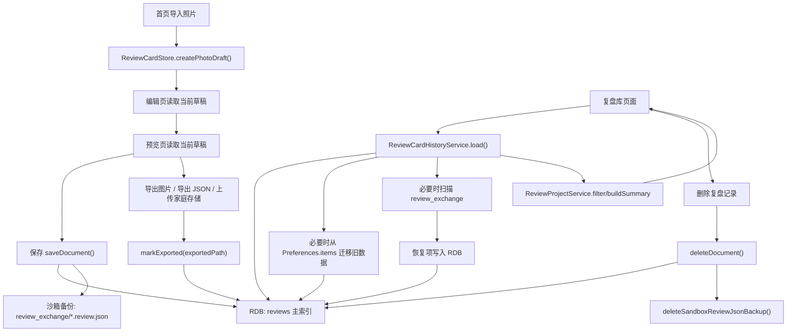

# 复盘库存储架构审计

更新时间：2026-06-26

本文基于当前 HarmonyOS 端代码实现整理，目标是准确描述复盘库当前的主存储、备份、恢复、删除和风险边界。本文不代表未来目标架构，只描述现在已经落地的行为。

相关文档：

- 产品字段模型见 [`DATA_MODEL.md`](./DATA_MODEL.md)
- `review.json` 交换字段语义见 [`REVIEW_JSON_SEMANTICS.md`](./REVIEW_JSON_SEMANTICS.md)
- review bundle v1 设计见 [`REVIEW_BUNDLE_V1_DESIGN.md`](./REVIEW_BUNDLE_V1_DESIGN.md)

## 一、当前存储架构

### 1. `ReviewCardStore` 的职责

- `ReviewCardStore` 是编辑态的内存单例。
- 它负责在首页、编辑页、预览页之间暂存“当前这张正在复盘的文档”。
- 它不负责复盘库列表的长期持久化。
- 它的典型能力包括：
  - 创建一条新的照片草稿
  - 读取当前草稿
  - 覆盖当前草稿
  - 在保存前刷新 `updatedAt`

参考代码：
- `entry/src/main/ets/services/ReviewCardStore.ets`

### 2. `ReviewCardHistoryService` 的职责

- `ReviewCardHistoryService` 是复盘库历史记录的主入口服务，页面层只通过它读写复盘库。
- 它负责：
  - 优先从 RDB 读取历史记录
  - 将保存、更新、删除、导出标记写入 RDB 主索引
  - 在保存/更新时写入一份 `review.json` 沙箱备份
  - 在 RDB 为空且旧数据存在时触发 `Preferences -> RDB` 迁移
  - 在有限恢复场景下扫描 `review_exchange` 目录并将恢复项写入 RDB
  - 删除历史项
  - 维护 `exportedPath`
  - 输出诊断信息

参考代码：
- `entry/src/main/ets/services/ReviewCardHistoryService.ets`

### 3. `ReviewProjectService` 的职责

- `ReviewProjectService` 不负责存储。
- 它建立在 `ReviewCardHistoryService.load(...)` 返回的数据之上，负责：
  - 搜索
  - 判断状态筛选
  - 复盘库摘要构建
  - 首页/复盘库统计
  - 轻量摘要文案提炼

换句话说，它是“读模型加工层”，不是“写入层”。

参考代码：
- `entry/src/main/ets/services/ReviewProjectService.ets`

### 4. RDB `reviews` 的职责

- 当前复盘库唯一主索引是 ArkData RDB / RelationalStore 中的 `reviews` 表。
- `saveDocument` / `updateDocument` / `deleteDocument` / `markExported` 都以 RDB 为主写目标。
- `loadWithDiagnostics` 优先初始化并查询 RDB；RDB 有记录时直接返回，不再合并 `Preferences.items` 残留数据。
- RDB 行保留 `raw_document_json`，用于完整还原 `ReviewCardDocument`。
- 标题、判断、图片引用、关系、卡点、导出路径等字段作为索引列存在，方便列表、筛选、搜索和统计。

参考代码：
- `entry/src/main/ets/services/ReviewCardRdbService.ets`
- `entry/src/main/ets/services/ReviewCardRdbModel.ets`

### 5. `Preferences(review_card_history.items)` 的职责

- `Preferences(review_card_history.items)` 已不再是复盘库主索引，也不再参与保存、更新、删除、导出标记的常规写入。
- `Preferences` 名称为：
  - `review_card_history`
- 旧历史 key 为：
  - `items`
- 该 key 的值是旧版本留下的 JSON 字符串，反序列化后为 `ReviewCardHistoryItem[]`。
- 当前仅保留为旧版本升级时的一次性迁移来源和诊断来源。
- RDB 为空且 `rdb_main_index_ready` 尚未标记时，才会读取该 key 并迁移到 RDB。
- RDB 已接管后，即使 `Preferences.items` 仍有旧残留，也不会污染当前主列表。

当前每条历史项结构：

```ts
interface ReviewCardHistoryItem {
  document: ReviewCardDocument;
  exportedPath: string;
}
```

其中：
- `document` 保存复盘正文和图片引用
- `exportedPath` 保存导出结果引用

参考代码：
- `entry/src/main/ets/services/ReviewCardHistoryService.ets`
- `entry/src/main/ets/services/ReviewCardMigrationService.ets`
- `entry/src/main/ets/model/ReviewCardModel.ets`

### 6. `review_exchange/*.review.json` 的职责

- `review_exchange` 目录位于应用沙箱 `context.filesDir` 下。
- 每次 `saveDocument` / `updateDocument` 时，会额外写入一份 `review.json` 备份。
- 这份备份的职责有两个：
  - 作为可恢复副本
  - 作为跨端交换的兼容格式基础

注意：
- 它不是复盘库列表的主查询源。
- 但当前实现已经支持在部分条件下扫描该目录并重建历史项。
- 阶段 5 后，恢复结果写入 RDB，不再回写 `Preferences.items`。

参考代码：
- `entry/src/main/ets/services/ReviewCardHistoryService.ets`
- `entry/src/main/ets/services/ReviewJsonExportService.ets`

### 7. `exportedPath` 的职责

- `exportedPath` 记录的是“这条复盘记录最近一次导出结果的引用”。
- 这个导出结果可能是：
  - 导出的图片在图库中的 URI
  - 导出的 `review.json` 目标 URI
  - 上传到家庭存储后的远端路径
- 它用于表达“这条复盘是否已导出/同步过”，不是原图路径。

参考代码：
- `entry/src/main/ets/services/ReviewCardHistoryService.ets`
- `entry/src/main/ets/pages/PreviewPage.ets`

### 8. `imageUri` 的含义和风险

- `imageUri` 保存的是原始照片的 URI 或路径引用。
- 当前复盘库不会保存原图二进制。
- 因此复盘记录本身只是“引用原图”，不是“把原图归档进复盘库”。

这带来的风险包括：
- 原图被用户删除后，`imageUri` 可能失效
- 系统资源 URI 的权限或可访问性可能变化
- 跨设备同步时，另一个设备无法直接使用本地 URI
- 仅凭复盘库记录无法保证永远重新打开原图

参考代码：
- `entry/src/main/ets/services/ReviewCardStore.ets`
- `entry/src/main/ets/services/ReviewProjectService.ets`

## 二、当前数据流

### 文字说明

1. 首页导入照片后，创建当前草稿并写入 `ReviewCardStore`
2. 编辑页读取 `ReviewCardStore`，用户填写复盘内容
3. 进入预览页后，当前文档仍以 `ReviewCardStore` 为当前工作副本
4. 保存时：
   - 文档先更新 `updatedAt`
   - 通过 `ReviewCardHistoryService.saveDocument(...)` 写入 RDB `reviews`
   - 同时写入 `review_exchange/*.review.json` 备份
5. 复盘库页面加载时：
   - 调用 `ReviewCardHistoryService.load(...)`
   - 优先读取 RDB
   - RDB 为空且迁移未完成时，从 `Preferences.items` 迁移旧数据
   - 必要时扫描 `review_exchange` 目录并将恢复项写入 RDB
   - 将结果交给 `ReviewProjectService` 做搜索、筛选和统计
6. 图片导出或 JSON 导出后：
   - 调用 `markExported(...)`
   - 更新 RDB 中该历史项的 `exportedPath`
7. 删除复盘记录时：
   - 硬删除 RDB 中对应历史项
   - 同时删除该条记录的沙箱 `review.json` 备份文件
   - 不删除原始照片
   - 不删除用户已导出的图片

### Mermaid 图



## 三、主数据源定义

当前必须明确以下事实：

- 复盘库当前主索引是 RDB `reviews`
- `Preferences` 中的 `review_card_history.items` 已退出常规主索引
- `Preferences(review_card_history.items)` 只是旧数据迁移 / 诊断来源，不再是常规写入目标
- `review_exchange/*.review.json` 是恢复备份和交换副本，不是复盘库列表的主查询源
- 原图不进入复盘库，只保存 `imageUri` / 路径引用
- `exportedPath` 是导出结果引用，不等于原图，也不等于原图备份

补充说明：
- 当前实现虽然在特定条件下会扫描 `review_exchange` 并重建历史项，但恢复结果写入 RDB，因此长期主索引仍然是 RDB。

### RDB / review_exchange / review bundle 边界

review bundle v1 加入后，三者边界应保持如下：

| 对象 | 角色 | 是否本地复盘库主索引 | 是否跨端接力格式 |
| --- | --- | --- | --- |
| RDB `reviews` | HarmonyOS 本地复盘库主读主写索引，负责列表、搜索、筛选、统计、更新和删除。 | 是 | 否 |
| `review_exchange/*.review.json` | 应用沙箱内备份、交换和有限恢复来源。 | 否 | 有限支持 |
| review bundle | 家庭存储中的目录级交换 / 备份 / 接力格式，包含 `review.json`、导出图、缩略图和 `manifest.json`。 | 否 | 是 |

review bundle 不参与 HarmonyOS 本地复盘库主索引查询，也不替代 RDB。家庭存储中的 bundle 是用户已经导出的外部资产，删除 HarmonyOS 本地记录时不应自动删除它。

## 四、删除语义

当前删除行为如下：

- 删除复盘库记录时，会硬删除 RDB 中的对应历史项
- 不默认删除原始照片
- 不默认删除用户已经导出的图片
- 当前代码会删除这条记录对应的沙箱 `review_exchange` 备份文件
- 当前没有“彻底删除所有关联导出物”的统一能力

这意味着当前删除语义是：

- 删除的是“RDB 复盘库索引项 + 沙箱备份”
- 不删除“原始照片”
- 不删除“用户导出到图库或用户文件系统的结果”

如果后续要支持“彻底删除”，应作为独立能力设计，至少要单独定义：
- 是否删除原图
- 是否删除图库导出图
- 是否删除用户手动导出的 JSON
- 是否删除家庭存储远端文件

参考代码：
- `entry/src/main/ets/services/ReviewCardHistoryService.ets`
- `entry/src/main/ets/services/ReviewJsonExportService.ets`

## 五、恢复语义

当前实现并不是“只有备份，没有恢复”。

当前行为是：

- `ReviewCardHistoryService.loadWithDiagnostics(...)` 先读 RDB
- RDB 为空且迁移未完成时，会读取 `Preferences.items` 并迁移到 RDB
- 如果 RDB 和 Preferences 都无法提供记录，会扫描 `review_exchange` 目录
- 扫描到的 `*.review.json` / `*.json` 会被解析为 `ReviewCardHistoryItem`
- 恢复项会写入 RDB，作为有限恢复结果
- 不再重新持久化回 `Preferences.items`

因此，当前恢复语义可以准确描述为：

- 当 RDB 和旧 Preferences 都无法提供可用记录时，系统会尝试从 `review_exchange` 扫描并恢复索引
- 当前恢复是“轻量自动恢复”，不是用户可见的独立恢复流程
- 当前没有单独的“手动重建索引”入口
- 当前没有更细粒度的恢复冲突处理、人工确认或恢复日志界面

参考代码：
- `entry/src/main/ets/services/ReviewCardHistoryService.ets`

## 六、当前方案优点

- RDB 已成为复盘库主读主写索引，能承接列表、搜索、筛选、统计、更新和删除。
- `raw_document_json` 保留完整文档快照，降低字段演进和旧记录兼容成本。
- `review_exchange` 继续作为沙箱备份、交换和有限恢复来源，便于人工排障和异常恢复。
- `Preferences.items` 退到迁移 / 诊断来源，避免旧数据残留污染当前主列表。
- 页面层仍通过 `ReviewCardHistoryService` 读写历史，底层存储变化不泄漏到 UI。
- 删除语义已经收口为“本地索引 + 沙箱备份”，不会误删原图、图库导出物或家庭存储复盘包。

## 七、当前方案风险

### 1. RDB 写失败需要更明确的用户反馈

- 当前不再静默写 `Preferences` 当主索引回退。
- 保存 / 更新失败时会 best-effort 写 `review_exchange` 备份并向上抛出错误。
- 当前 UI 已有基础失败 toast，后续可以补“已保留沙箱备份，可稍后恢复”的更明确提示。

### 2. `Preferences.items` 残留需要继续作为迁移来源保留

- 旧版本升级时仍需要读取 `Preferences.items`。
- 不能为了退场清理彻底删除迁移读取能力。
- 诊断入口仍需要能统计旧 Preferences 数据数量。

### 3. `imageUri` 可能失效

- 原图只保留引用
- 原图被删除、移动、失去权限后，复盘记录会失去图像可用性

### 4. RDB 与 `review_exchange` 可能不一致

- 沙箱备份和 RDB 主索引不是强事务同步
- 某些异常场景下可能出现：
  - RDB 已更新但备份未写成功
  - 备份在，但 RDB 写入失败或被清空

### 5. `exportedPath` 可能失效

- 用户导出的文件、图库 URI、远端路径都可能在后续失效
- 当前没有统一校验其可用性的机制

### 6. 缺少分页能力

- 当前页面仍以完整列表方式消费 `ReviewCardHistoryService.load(...)` 结果
- 条目多后，首屏加载会越来越重

### 7. 缺少更强的索引能力

- RDB 已具备索引基础，但页面层搜索 / 筛选仍主要走现有 `ReviewProjectService` 加工链路
- 后续可以逐步把分页、关键词、判断筛选下推到 RDB 查询

### 8. 缺少更强的自动恢复索引能力

- 当前只有基础扫描和合并
- 没有用户可见的“恢复向导”
- 没有更完善的冲突处理和恢复策略

### 9. 缺少显式的数据版本迁移管理

- 目前更多依赖兼容解析
- 随着字段、结构、同步能力增加，迁移成本会上升

## 八、短期改进建议

短期建议围绕 RDB 主索引稳态做收口：

- 为 `ReviewCardHistoryService` 增加更多 RDB 写失败 / 备份恢复真机验证
- 保留并验证 `Preferences JSON` 旧数据迁移容错
- 增加空数组、坏数据、字段缺失、旧结构输入的兼容覆盖
- 在产品文档和交互层明确删除行为
- 在 UI 层明确 `imageUri` 失效时的降级表现
- 补保存失败时的更明确提示
- 如需进一步稳态化，可考虑把恢复诊断信息暴露到调试页或设置页

本轮不建议做：

- 修改现有 `Review JSON` 字段
- 让 `review_exchange` 取代 RDB 成为主查询源
- 删除 `Preferences.items` 迁移读取能力

## 九、中期迁移建议

RDB 主索引已经落地。中期建议从“迁移”转为“RDB 查询能力和同步能力增强”：

- 复盘记录超过 300 / 500 / 1000 条
- 需要分页加载
- 需要复杂搜索和统计
- 需要跨端同步冲突处理
- 需要按照片、标签、时间、成立状态建立索引
- 需要多设备增量同步

可以考虑的方向包括：

- 分页查询、关键词搜索、判断筛选逐步下推到 RDB
- `review.json` 继续保留为交换格式和恢复备份格式
- 将原图引用、历史索引、导出状态、同步状态解耦
- 增加显式 schema version 与迁移流程

## 十、验收标准

本文确认以下事实成立：

- 当前代码已经使用 RDB `reviews` 作为复盘库唯一主索引
- `Preferences(review_card_history.items)` 已退场为旧数据迁移 / 诊断来源
- `review_exchange/*.review.json` 不是主查询源
- 原图二进制没有进入复盘库
- `imageUri` 保存的是引用
- `exportedPath` 保存的是导出结果引用
- 删除复盘记录不会默认删除原图和用户导出结果
- 当前删除会同步删除对应沙箱 `review_exchange` 备份
- 当前存在有限的自动恢复逻辑：会在特定条件下扫描 `review_exchange` 并写入 RDB
